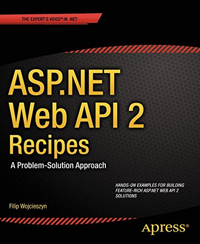
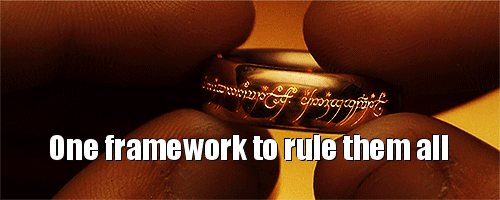
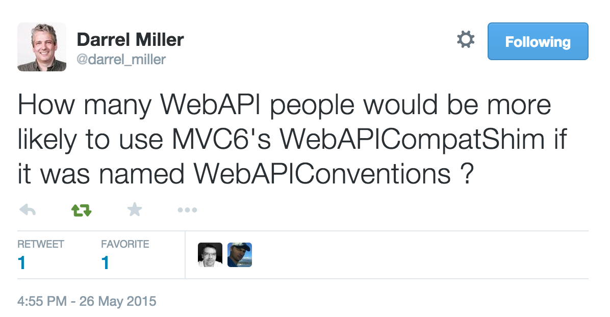

- title : Migrating from Web API to MVC 6
- author : Filip W
- theme : simple
- transition : default

***

# Migrating from ASP.NET Web API to MVC 6

***

## Filip W

[strathweb.com](www.strathweb.com)

[@filip_woj](www.twitter.com/filip_woj)

[github.com/filipw](github.com/filipw)

***

## ASP.NET Web API 2 Recipes

***

***

## HTTP services in ASP.NET

 - HTTP Handlers
 - ASMX
 - WCF Web Http | WCF REST Starter Kit
 - ASP.NET MVC
 - WCF Web API | ASP.NET Web API

***

***

# ASP.NET MVC 6

***

***

## Migration to MVC 6

 - runs on top of DNX
 - new set of HTTP abstractions
 - generally defaults to MVC conventions, making Web API migration/development slightly confusing
 - very flexible and customizable framework
 - Web API Compatibility Shim

***

## Web API Compatibility Shim

***

***
